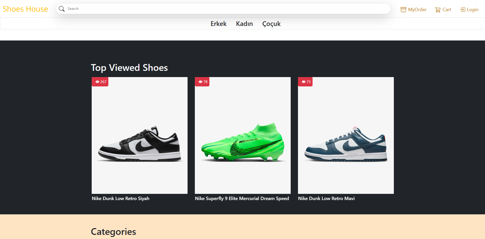
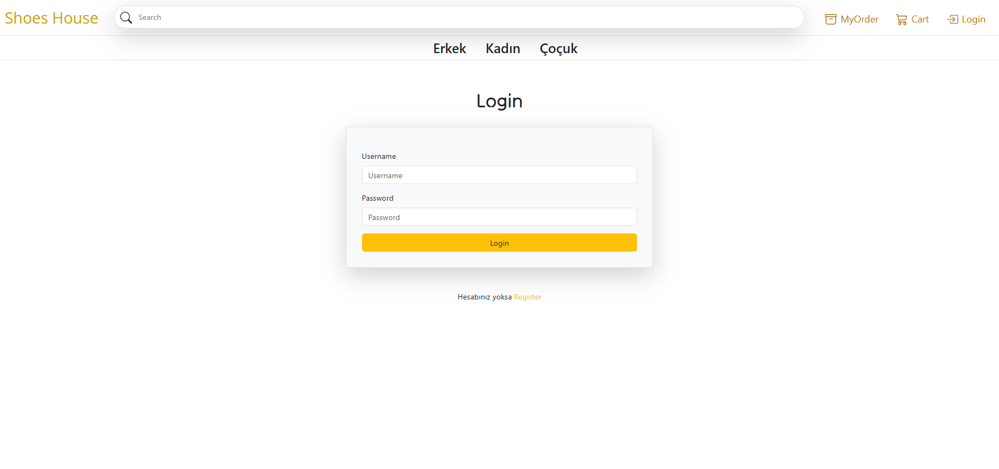
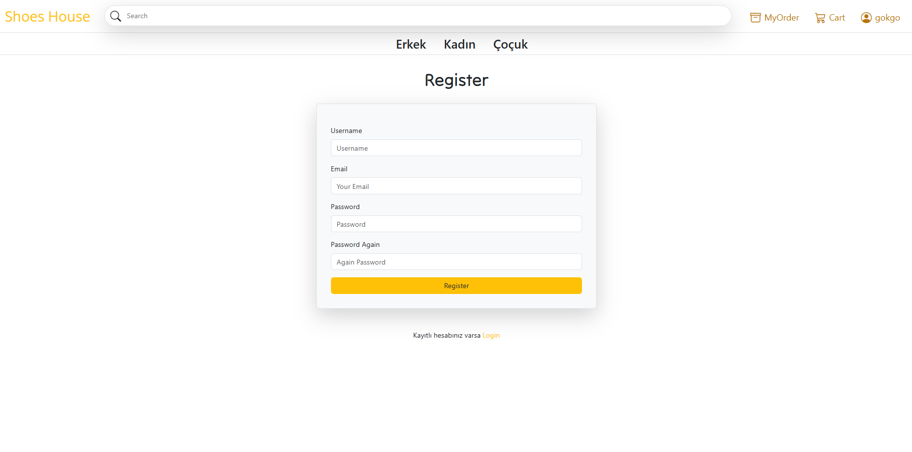
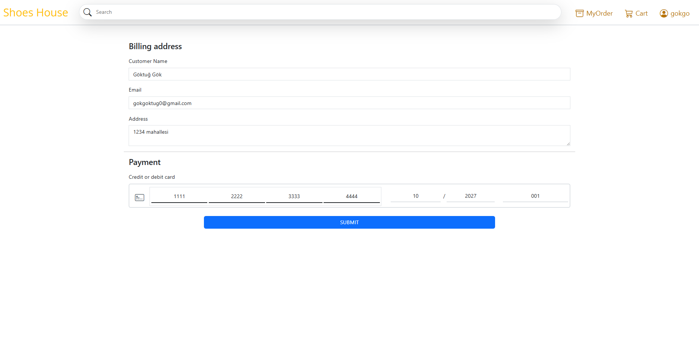
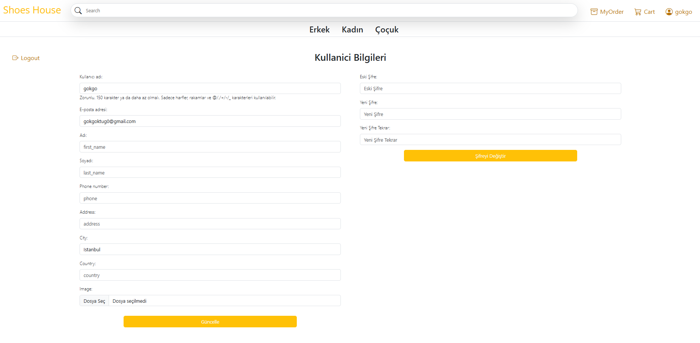
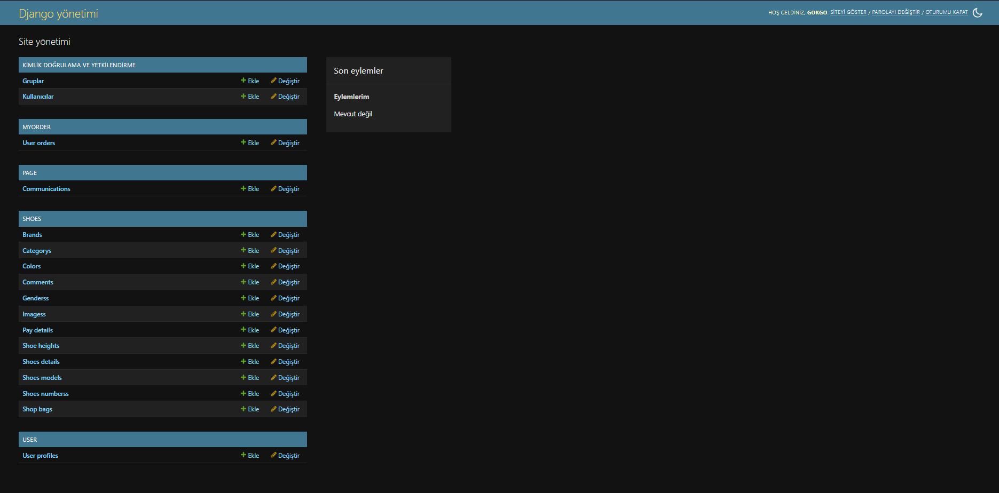

# 👟 Shoes House – E-Ticaret Ayakkabı Mağazası

**Shoes House**, Django ve Bootstrap kullanılarak geliştirilmiş bir e-ticaret platformudur.  
Kullanıcılar ayakkabıları inceleyebilir, sepete ekleyebilir, sipariş verebilir ve hesaplarını yönetebilir.  
Görsel olarak şık, yapısal olarak sağlam! 😎💼

---

## ✨ Özellikler

### 👤 Kullanıcı İşlemleri
- ✅ Kayıt & Giriş sistemi
- ✅ Şifre doğrulama & güncelleme
- ✅ Profil bilgileri düzenleme
- ✅ Güvenli çıkış yapma

### 👟 Ürün Yönetimi
- ✅ Kategoriye göre listeleme (Erkek / Kadın / Çocuk)
- ✅ Filtreleme (renk, numara, topuk yüksekliği vs.)
- ✅ Sepete ekleme / çıkarma
- ✅ Sipariş geçmişi & detayları

### 💳 Ödeme Sistemi
- ✅ Kredi kartı ile ödeme (dummy)
- ✅ Fatura adresi düzenleme
- ✅ Sipariş özeti

### ✉️ İletişim
- ✅ Müşteri mesaj sistemi
- ✅ İletişim formu

---

## 🖼️ Ekran Görüntüleri

### 🏠 Ana Sayfa

### 🔐 Giriş Sayfası

### 📝 Kayıt Sayfası

### 🛒 Sepet

### 💳 Ödeme Sayfası

### 👤 Profil Sayfası

### 👟 Ürün Listesi

### 📬 İletişim

### 🛠️ Admin Panel

---

## ⚙️ Kurulum

- git clone https://github.com/GoktugGok/Shoes_Shop.git

- cd shoes-house

- python -m venv venv

- Windows: venv\Scripts\activate

- Mac/Linux: source venv/bin/activate

- python manage.py migrate

- python manage.py createsuperuser  # (Opsiyonel)

- python manage.py runserver

