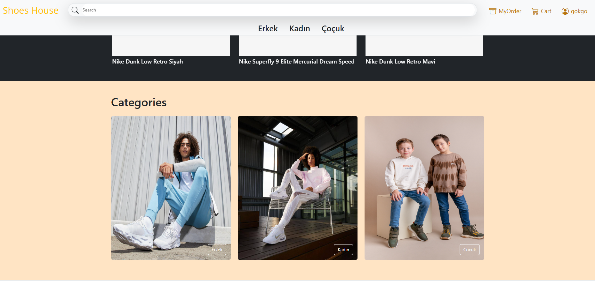
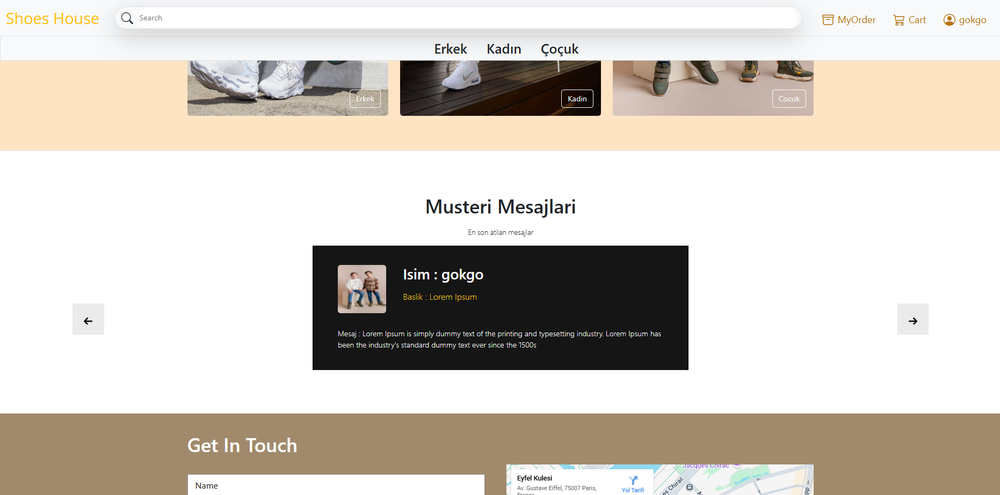
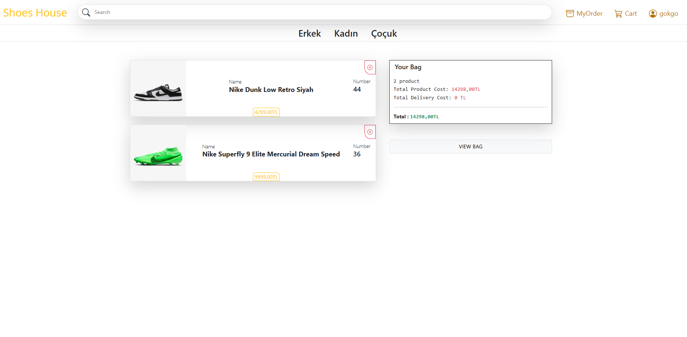
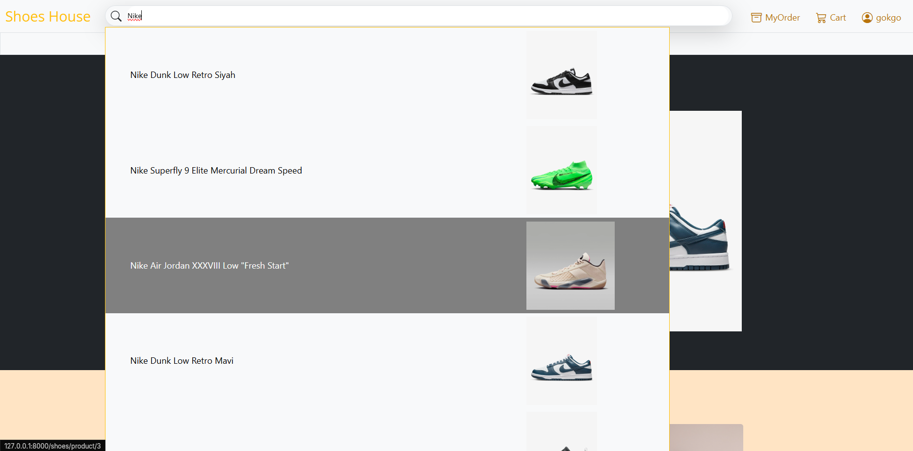
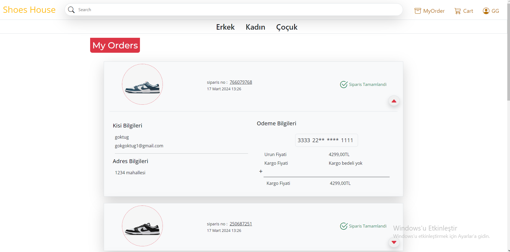
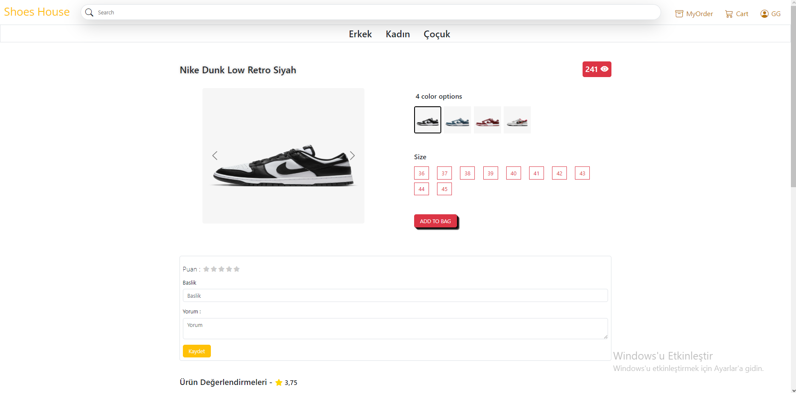
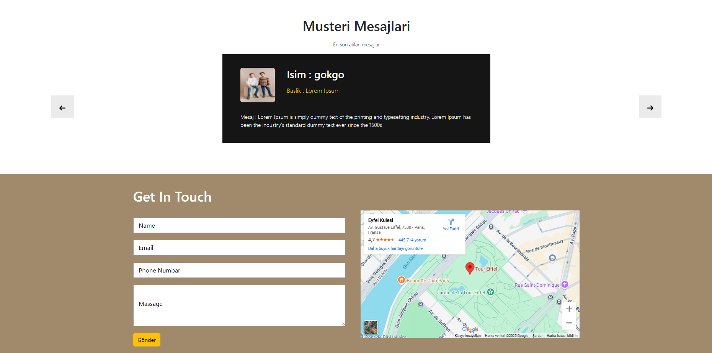

# 👟 Shoes House – E-Commerce Shoe Store

**Shoes House**, Shoes House is an e-commerce platform developed using Django and Bootstrap.
Users can browse shoes, add them to cart, place orders, and manage their accounts.
Visually elegant, structurally solid! 😎💼

---

## ✨ Features

### 👤 User Operations
- ✅ Registration & Login system
- ✅ Şifre doğrulama & güncelleme
- ✅ Edit profile information
- ✅ Secure logout

### 👟 Product Management
- ✅ Listing by category (Men / Women / Kids)
- ✅ Filtering (color, size, ankle height, etc.)
- ✅ Add/remove from cart
- ✅ Order history & details

### 💳 Payment System
- ✅ Credit card payment
- ✅ Edit billing address
- ✅ Order summary

### ✉️ Contact
- ✅ Customer message system
- ✅ Contact form

---

## 🖼️ Screenshots

### 🏠 Home Page  
Categorized products, campaigns, and featured shoes.

### 🔐 Login Page  
User login form with email and password.

### 📝 Register Page  
New user registration screen.

### 🛒 Cart  
Shows products added to cart and total amount.

### 💳 Payment Page  
Billing information and credit card form.

### 👤 Profile Page
User information, address, and password management.

### 🔎 Search 
Page allowing product search by name.
> 🔍 Users can search by product name.

### 📦 Order History (My Orders)  
Page listing user's previous orders.
> 📋 Displays order number, date, total amount, and status.

### 👟 Product Detail Page
Large image, description, price, and add-to-cart button for selected product.  
> 🧾 Includes size and color information. Purchasing users can leave reviews and ratings.

### 📬 Contact  
Customer message form and contact information.

### 🛠️ Admin Panel  
Administrator screen for managing products, orders, and users.

---

## ⚙️ Installation

Clone the repository
   
- git clone https://github.com/GoktugGok/Shoes_Shop.git

Enter the project folder
   
- cd Shoes_Shop

Create virtual environment
   
- python -m venv env

Activate environment
   
- Windows:
venv\Scripts\activate

- Mac/Linux:
source venv/bin/activate

Install requirements
   
- pip install -r requirements.txt

Create database
   
- python manage.py migrate

(Optional) Create admin user
   
- python manage.py createsuperuser

Run server
   
- python manage.py runserver

